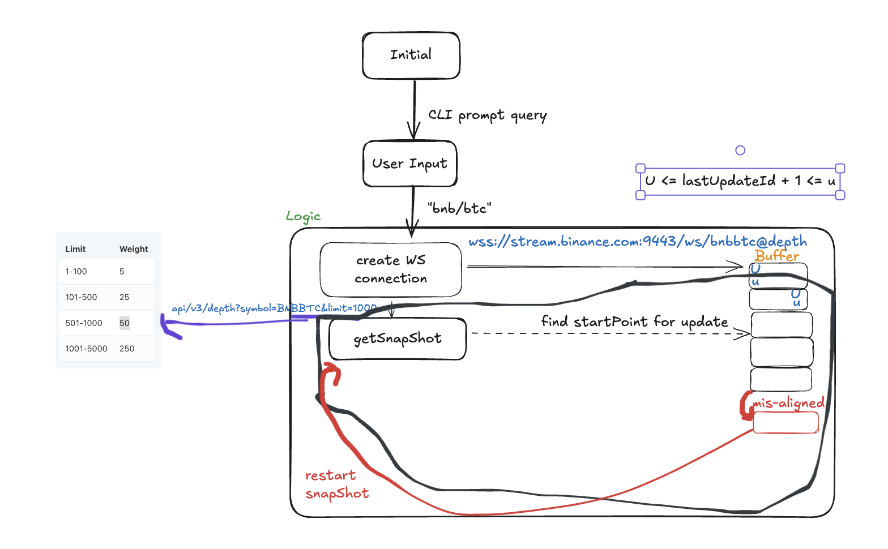

# Binance order book

- [Binance order book](#binance-order-book)
  - [Goal](#goal)
  - [General Notes (Abstracted)](#general-notes-abstracted)
  - [Flow](#flow)
  - [Steps](#steps)
  - [Pointers](#pointers)
  - [Developer Guide](#developer-guide)
  - [Demo](#demo)
  - [References](#references)

## Goal
- CLI, query the user for binance-style symbol
- prints out top 5 levels of the orderbook (when a snapshot or depth comes in) 


## General Notes (Abstracted)
- Depth snapshots having a limit on number of price levels -> (For example 50 bids and asks)
  - Price level received from websocket
    - if it exists within the local snapshot, update the quantity of that price level, if remaining is 0 -> remove that price level
    - if the price level doesn't exists in the local snapshot (The original 50 bids or asks) -> Just add into the order book
    - Afterwards have to check whether or not the order book is within the correct range

Note: Due to depth snapshots having a limit on the number of price levels, a price level outside of the initial snapshot that doesn't have a quantity change won't have an update in the Diff. Depth Stream. 

Consequently, those price levels will not be visible in the local order book even when applying all updates from the Diff. Depth Stream correctly and cause the local order book to have some slight differences with the real order book. 

However, for most use cases the depth limit of 5000 is enough to understand the market and trade effectively.


## Flow


## Steps
1. Install these dependencies
```
brew install websocketpp
brew install boost
brew install curl
brew install nlohmann-json
brew install openssl // if applicable
```

2. (For macbook) (Faced some error regarding openssl in boost missing in ARM64 device...)
```
g++ -std=c++17 -o ./binance_local_book orderbook.cpp \
    -I/opt/homebrew/include \
    -L/opt/homebrew/opt/openssl/lib \
    -L/opt/homebrew/opt/boost/lib \
    -I/opt/homebrew/opt/nlohmann-json/include/nlohmann \
    -L/opt/homebrew/opt/curl/lib \
    -lssl \
    -lcrypto \
    -lpthread \
    -lboost_system \
    -lcurl
```
- I/path/to/openssl/include: Path to OpenSSL header files.
- I/path/to/boost/include: Path to Boost header files (if applicable).
- L/path/to/openssl/lib: Path to OpenSSL library files.
- L/path/to/boost/lib: Path to Boost library files (if applicable).
- lssl: Link against the OpenSSL SSL library.
- lcrypto: Link against the OpenSSL Crypto library.
- lpthread: Link against the POSIX thread library.
- lboost_system: Link against the Boost System library (if applicable).


## Pointers
- cpp project modify include path to point to the libraries installed (for linter)
- `-I/opt/homebrew/include` to let compiler to know the path
- `-std=c++17` need to tell compiler cpp verion
- `openssl` is required from `boost`, dk why not in ARM64 device

## Developer Guide
**`fetchSnapshot`**

Fetches the current order book snapshot from the Binance API.

**`initOrderBook()`**

Initialise the order book `bids` and `asks` which are implemented using `map` to maintain the sorted order

**`manageOrderBook()`**

Checks whether or not is a `bid` or an `ask`
- If the price exists within the order book then we need to update the quantity, if it reaches 0 then we need to remove it
- If a new price update comes in, then add into our order book and remove the lowest price for `bid` or the highest price for `ask` 

**`updateOrderBook(json jsonMessage)`**

Given the `lastUpdatedId` we check whether or not the current update is aligned. If it's aligned then we update the book accordingly using `manageOrderBook()`.
- If the message is old, then we can just skip it
- If the message is so new, that our orderbook is outdated, then we need to reset our order book by calling `initOrderBook()`

## Demo
[click here to watch the demo](https://drive.google.com/file/d/1qfhn1H6fhu34cv1RzCeE1jNkILmUvGaO/view?usp=sharing)

## References
- [To setup websocket in CPP](https://medium.com/nerd-for-tech/your-first-c-websocket-client-4e7b36353d26)
